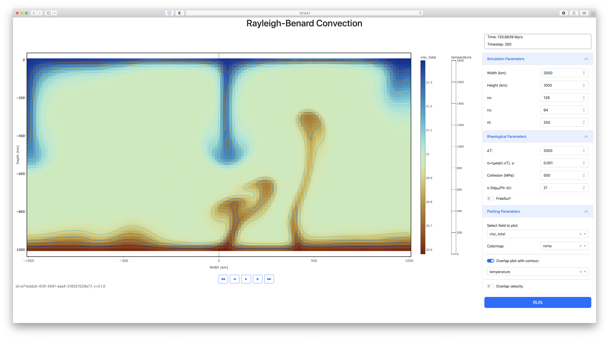
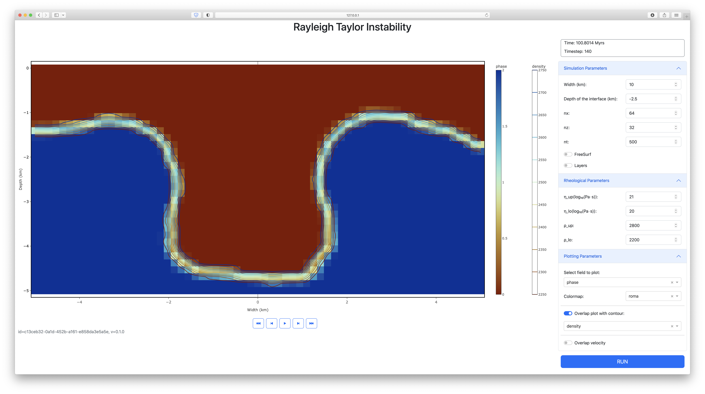

# InteractiveGeodynamics.jl

> [!CAUTION]
> The current version of InteractiveGeodynamics requires julia version 1.9.x and does not work with the latest julia release (1.10). We are working on fixing this but until that is done, please use julia 1.9.4 instead, which you can download [here](https://julialang.org/downloads/oldreleases/) 

This package provides a range of graphical user interfaces (GUI's) to study and experiment with different geodynamic problems without need to program. It uses [julia](https://julialang.org) and [Dash](https://dash.plotly.com/julia) and automatically installs the required geodynamic software (such as [LaMEM](https://github.com/JuliaGeodynamics/LaMEM.jl)) in the background.

This is particularly useful for teaching.
We currently have the folloeing examples included:
- `convection()` - 2D mantle  (or magma chamber) convection
- `rayleigh_taylor()` - density driven instability
- `rising_sphere()` - rising stokes sphere example

### Getting started/requirements
Installing this is straightforward. Start julia

```julia
kausb$ julia
               _
   _       _ _(_)_     |  Documentation: https://docs.julialang.org
  (_)     | (_) (_)    |
   _ _   _| |_  __ _   |  Type "?" for help, "]?" for Pkg help.
  | | | | | | |/ _` |  |
  | | |_| | | | (_| |  |  Version 1.9.3 (2023-08-24)
 _/ |\__'_|_|_|\__'_|  |  Official https://julialang.org/ release
|__/                   |

julia>
```
1) Go to the package manager by pressing `]` and type: 
```julia
julia>]
(@v1.9) pkg> add InteractiveGeodynamics
 ```
2) Then download all required packages with

```julia
(@v1.9) pkg> instantiate
 ```
This can take some time the first time you do this. Note that step 1 & 2 only have to be done once. Go back to the main command window with backspace.

3) Start the GUI: 
```julia
julia> using InteractiveGeodynamics
julia> convection()
[ Info: Listening on: 127.0.0.1:8050, thread id: 1
```
It will take a bit of time (to precompile/download all required packages). Next, open tye displayed web address in your browser (127.0.0.1:8050 in this case) and it will start a GUI. After pushing `Run`, you'll get something that looks like this: 
```julia
julia> 
Timestep 0
args = -nstep_max 250 -eta_fk[0] 1.0e21  -gamma_fk[0] 0.001 -TRef_fk[0] 1000.0 -ch[0] 5.0e8 -nel_x 128 -nel_z 64 -coord_x -1000.0,1000.0 -coord_z -1000,0 -coord_y -7.8125,7.8125 -temp_bot 2000
Timestep 1
Timestep 10
Timestep 15
Timestep 15
Timestep 20
Timestep 25
Timestep 30
```


### Running the examples

Running the other examples is  straightforward. For example, the Rayleigh-Taylor example can be started with:
```julia
julia> using InteractiveGeodynamics
julia> rayleigh_taylor()
[ Info: Listening on: 127.0.0.1:8050, thread id: 1
Tiestep 0
args = -nstep_max 50 -eta[0] 1.0e21 -eta[1] 1.0e21 -eta[2] 1.0e20 -rho[0] 2800 -rho[1] 2800 -rho[2] 2200 -open_top_bound 0 -nel_x 32 -nel_z 16 -coord_x -5.0,5.0 
Timestep 1
Timestep 5
Timestep 10
Timestep 15
Timestep 20
Timestep 25
```



### Available examples
We currently have the following GUI's available:

- `convection()` 
- `rising_sphere()`
- `rayleigh_taylor()`
