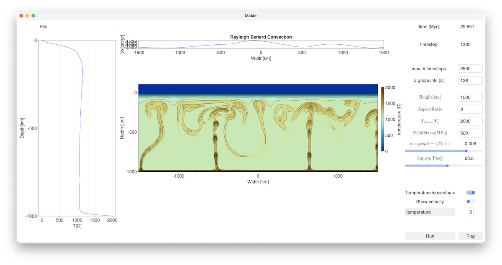

# InteractiveGeodynamics.jl

This package provides a range of graphical user interfaces (GUI's) to study and experiment with different geodynamic problems without need to program. 
It uses [julia](https://julialang.org) and [makie](https://docs.makie.org/stable/) and automatically installs the required geodynamic software (such as [LaMEM](https://github.com/JuliaGeodynamics/LaMEM.jl)) in the background.
This is particularly useful as part of teaching.


### Getting started/requirements
In order to use this, you do need to install some software on your machine. 
Please follow these steps if you haven't done this yet:
1) Install [Julia](https://julialang.org), which is a modern, high-level, scientific computer language that is open source, fast, and has a nice package manager. Please just download the precompiled binaries from their [webpage](https://julialang.org/downloads/).
2) Install [VSCode](https://code.visualstudio.com) by downloading the available binaries from the webpage.
3) Download [InteractiveGeodynamics.jl](https://github.com/JuliaGeodynamics/InteractiveGeodynamics.jl) to a directory of your choice on your machine by either: 
    a) Using `git clone https://github.com/JuliaGeodynamics/InteractiveGeodynamics.jl.git` (if you have git available in your terminal) 
    b) Or by going to the green `<> Code` button on the [webpage](https://github.com/JuliaGeodynamics/InteractiveGeodynamics.jl) and choosing the `Download ZIP` option (unzip it to a directory of your choice once it is downloaded) 
4) Start julia by double-clicking the downloaded julia binary or by typing `julia` in your terminal . This will start the julia `REPL`( see https://docs.julialang.org/en/v1/stdlib/REPL/ for different modes): 
```julia
kausb$ julia
               _
   _       _ _(_)_     |  Documentation: https://docs.julialang.org
  (_)     | (_) (_)    |
   _ _   _| |_  __ _   |  Type "?" for help, "]?" for Pkg help.
  | | | | | | |/ _` |  |
  | | |_| | | | (_| |  |  Version 1.8.5 (2023-01-08)
 _/ |\__'_|_|_|\__'_|  |  Official https://julialang.org/ release
|__/                   |

julia> 
```
5) Type `;` to change to the shell mode. With `backspace` you can always get back to the REPL
```julia
shell>
```
Let's assume that we downloaded `InteractiveGeodynamics.jl` to the directory `/Users/kausb/Downloads/InteractiveGeodynamics.jl` and that we want to run the example in `RayleighBenardConvection`:

On linux/mac this is done with:
```julia
shell>cd /Users/kausb/Downloads/InteractiveGeodynamics.jl/RayleighBenardConvection
```
On windows this can be done with:
```
TO BE ADDED
```
Return to the `REPL` with the backspace.


6) Go to the package manager and activate the package. After that, return to the `REPL` with a backspace 
```julia
julia>]
(@v1.8) pkg> activate ../.
  Activating project at `~/Downloads/InteractiveGeodynamics.jl`
(@v1.8) pkg> instantiate
```
The command `instantiate` downloads all you need. This can take some time the first time you do this.

7) Start the GUI: 
```julia
julia> include("Convection_LaMEM.jl")
Adding plotting routines of GeoParams through GLMakie 
Loading GLMakie plotting routines within GMG
run_code (generic function with 1 method)
```
It will take a bit of time (to precompile/download all required packages) but it will start a GUI. After pushing `Run`, you'll get something that looks like this: 
```julia
julia> [ Info: Running LaMEM simulation
args = "-nstep_max 250 -eta_fk[0] 1.0e21  -gamma_fk[0] 1.0e-9 -TRef_fk[0] 1000.0 -ch[0] 5.0e8 -nel_x 128 -nel_z 64 -coord_x -1000.0,1000.0 -coord_z -1000.0,0 -coord_y -8.0,8.0 -temp_bot 2000.0"
[ Info: created marker setup
Timestep 1
Timestep 10
Timestep 15
Timestep 15
Timestep 20
Timestep 25
Timestep 30
```


### Running the examples

Running the other examples is reasonably straightforward. Every directory contains a julia file, so change to that directory and run the julia file with `include("NAME.jl")`. For example, the Rayleigh-Taylor example can be started with:
```julia
shell>cd RayleighTaylorInstability/
julia> include("RTI_LaMEM.jl")
julia> [ Info: Running LaMEM simulation
[ Info: created marker setup
Timestep 1
Timestep 5
Timestep 10
Timestep 15
Timestep 20
Timestep 25
```

